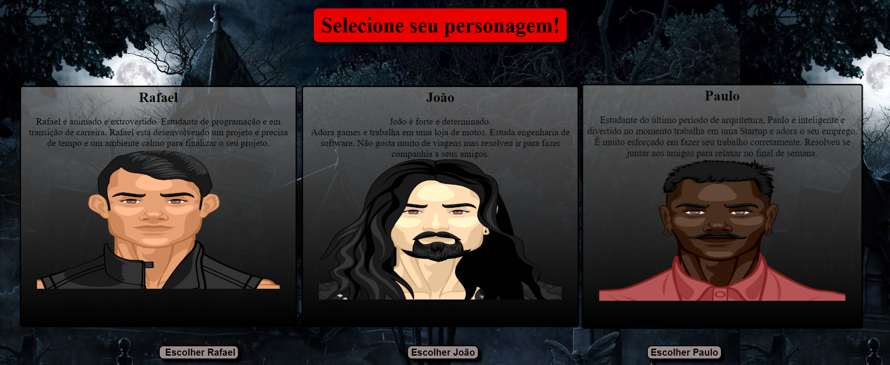

 

## Descrição

Meu primeiro projeto do bootcamp em desenvolvimento web da   **[RESILIA](https://www.resilia.com.br/)**  usando HTML e CSS !

A proposta do projeto era criação de um jogo temático de escolhas, usando somente HTML, CSS, e o pouco de javascript que estava começando a aprender para 
realização das escolhas das opções.

O jogo trata-se de uma história de terror vivida entre amigos.

Apesar do jogo ser algo simples, acredito que seja um grande avanço em apenas 1 mês de curso.

### O jogo está disponivel nesse link  - **[House-36](https://rafael753.github.io/house-36/)**
